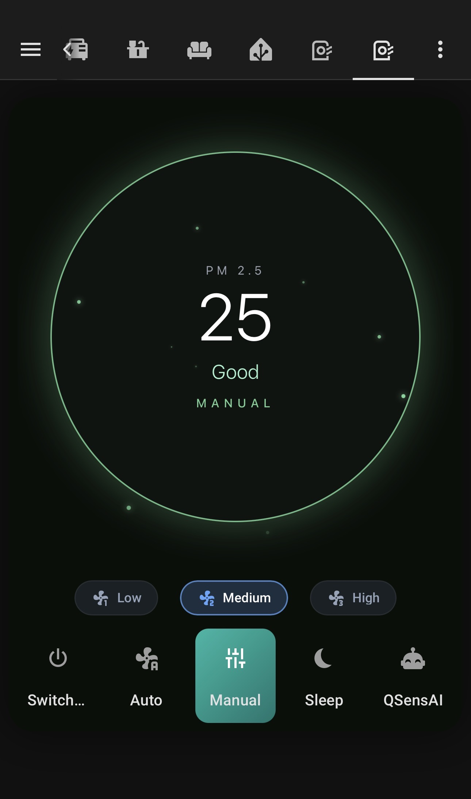
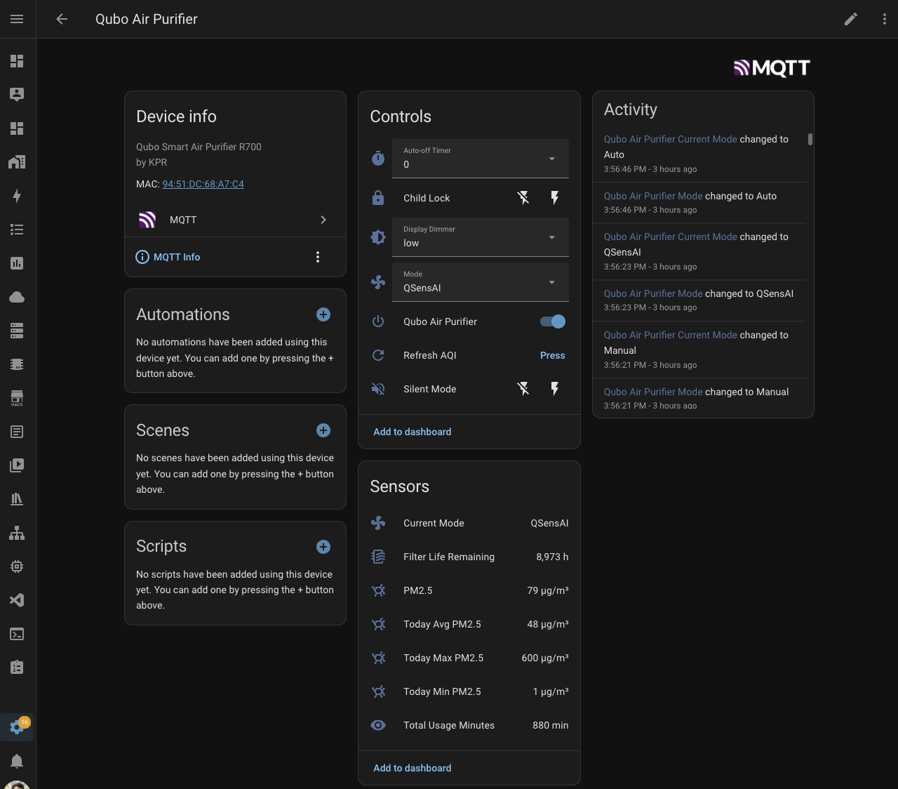
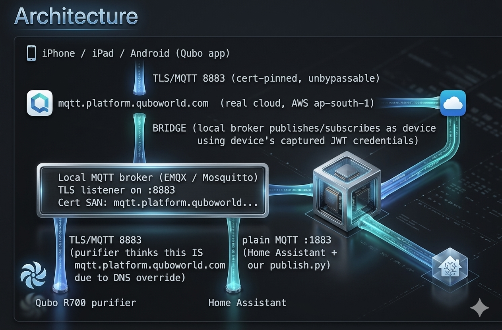

# qubo-ha-mqtt

Home Assistant integration for **Qubo** (Hero Electronix) smart devices via
MQTT Discovery — giving you **local control** of a cloud-only device while
keeping the **official Qubo app working** through an MQTT bridge.

Works with the **Qubo Smart Air Purifier R700** (HPH07). Adapter is designed
to extend to other Qubo models (smart plug, doorbell, etc.) by adding device
profiles.

<p align="center">
  
  &nbsp;
  
</p>

<p align="center">
  <em>Left: Qubo-app-style Lovelace dashboard · Right: all 18 auto-discovered entities in Home Assistant</em>
</p>

## Why this project exists

Out of the box, the Qubo Smart Air Purifier R700:

- Has **no local API**. All control goes through Qubo's cloud (AWS Mumbai MQTT
  broker).
- The **mobile app pins TLS certs** — blocks MITM at the app layer.
- But the **purifier itself** validates TLS with **relaxed** hostname check —
  if the server cert has `DNS:mqtt.platform.quboworld.com` in SAN, the device
  accepts it.

That last point is the crack. By pointing the device's DNS at a local MQTT
broker (with a matching cert), the purifier connects locally — giving us full
local control. An optional MQTT **bridge** keeps it synced to Qubo's real
cloud so the mobile app continues to work.

## Architecture

<p align="center">
  
</p>

- **Qubo app** (phone) → talks to the real Qubo cloud over TLS (cert-pinned)
- **Bridge** (inside your local broker) → speaks to the cloud as-if it were
  the device, using the device's captured JWT credentials
- **Local MQTT broker** → TLS listener on `:8883` with a cert whose SAN is
  `mqtt.platform.quboworld.com`
- **Purifier** → DNS-overridden to resolve `mqtt.platform.quboworld.com` to
  your broker; accepts the local cert because the SAN matches
- **Home Assistant** → plain MQTT on `:1883`, auto-discovers entities via
  `publish.py`

## Documentation

Setup is broken into numbered guides — follow in order:

| # | Guide | What it covers |
|---|-------|----------------|
| 1 | [Overview & prerequisites](docs/01-overview.md) | What you need, skills required |
| 2 | [MQTT broker TLS setup](docs/02-mqtt-broker-setup.md) | Mosquitto OR EMQX with TLS and correct cert |
| 3 | [Split DNS configuration](docs/03-dns-split.md) | pfSense, OPNsense, AdGuard, Pi-hole, router-level |
| 4 | [Capture device JWT](docs/04-capture-jwt.md) | One-time MITM to grab device credentials |
| 5 | [EMQX cloud bridge](docs/05-cloud-bridge.md) *(optional)* | Keep the Qubo app working alongside HA |
| 6 | [HA integration install](docs/06-ha-integration.md) | Run `publish.py`, verify entities in HA |
| 7 | [Lovelace dashboard](docs/07-lovelace-dashboard.md) | Qubo-app-style animated dashboard |
| 8 | [Troubleshooting](docs/08-troubleshooting.md) | Common issues and fixes |

## Quick start (for experienced users)

```bash
# 1. Clone
git clone <this-repo>
cd qubo-ha-mqtt

# 2. Generate TLS cert with correct SAN
./scripts/gen-certs.sh /path/to/broker-cert-dir 10.10.10.10

# 3. Configure your MQTT broker (Mosquitto/EMQX) per docs/02
# 4. Configure split DNS per docs/03
# 5. Capture device JWT per docs/04
# 6. Edit devices.yaml with captured UUIDs
# 7. Install deps and publish HA entities
python3 -m venv .venv && source .venv/bin/activate
pip install -r requirements.txt
python publish.py --refresh

# 8. (Optional) set up cloud bridge per docs/05
# 9. Paste lovelace/cards/main-unified-dashboard.yaml into HA dashboard
```

## Requirements

**Hardware / services:**
- A Qubo Smart Air Purifier R700
- Home Assistant (2024.1+)
- Local MQTT broker (Mosquitto or EMQX) — on any always-on host
- Router with DNS override capability, **or** pfSense/OPNsense/AdGuard/Pi-hole

**Skills:**
- Comfortable with Linux CLI, editing config files, reading logs
- Basic MQTT understanding (topics, retained messages, TLS)
- Ability to edit router/DNS settings on your network
- Patience for a one-time ~2 hour setup

**One-time manual steps:**
- Capturing the device's MQTT JWT (30-day expiry — repeat yearly or set up
  automatic refresh — see [cloud bridge docs](docs/05-cloud-bridge.md))

## What you get

After setup, Home Assistant has:

- **Fan entity**: power on/off, speed 1/2/3, preset modes (Auto, Manual,
  Sleep, QSensAI)
- **PM2.5 sensor** (live, every ~3s)
- **Filter life remaining** (hours)
- **Child lock, Silent mode** switches
- **Display dimmer, Auto-off timer** selects
- **Daily stats**: today's min/max/avg PM2.5 + total usage minutes
- **Buttons**: refresh AQI/filter/usage, reboot
- **Current Mode, Mode select**: for dashboard convenience
- **MCU firmware version** (diagnostic)

Plus a Qubo-app-style Lovelace dashboard with animated green halo.

## Limitations

- **Device JWT expires every 30 days.** Without the cloud bridge, you'll need
  to re-capture manually. With the bridge forwarding `/config/{unit}` topic
  from cloud, the device receives refreshed tokens automatically.
- **No schedule UI in HA.** Qubo schedules use a nested `ruleService` topic
  that maps awkwardly to HA. Use HA automations instead (they're more
  powerful anyway). Schedules set via the app continue to work.
- **Firmware updates** — triggered via cloud; the bridge forwards them through
  so this still works.
- **First-time setup requires MITM** to capture the JWT. Automating this for
  end users is non-trivial.

## License

MIT — see [LICENSE](LICENSE)

## Credits

- `dtechterminal/qubo-local-control` — prior art that inspired the approach
  (their README documented the device's permissive TLS behavior)
- Hero Electronix / Qubo — for making a decent device
